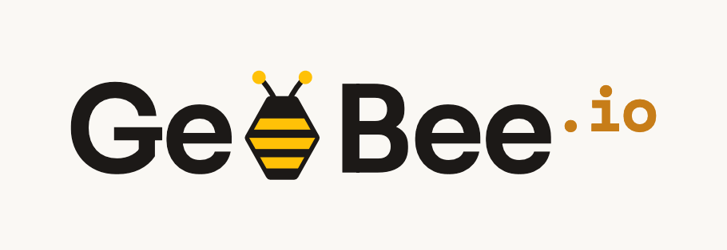

  

<h1 align="center">GeoBee.io</h1>

  <strong>The AI RiskOps & Intelligence Observability Platform</strong>

  <a href="https://geobee.io">Official Website</a> •
  <a href="https://github.com/geobee-io">GitHub Organization</a> •
  <a href="https://twitter.com/geobee">Twitter</a> •
  <a href="https://github.com/geobee-io/.github/discussions">Community</a>

---

## 💎 Why GeoBee.io?

**Trusted by millions of users across organisations**, GeoBee.io gives every worker, team and organisation calm, real-time awareness of the risks around their people, assets and places — and the means to act before harm occurs.

- 😎 **Calm over concern** - We reduce anxiety, never manufacture it. We inform and enable action; we do not alarm. Tone is a steady hand, not a siren.
- 🐝 **Protect the individual** - Every bee matters. The lone worker gets the same care as the enterprise. Safety is never a privilege of scale.
- 🔦 **Clarity is safety** - In a risk moment, ambiguity is dangerous. We design for the fastest possible understanding — plain words, clear signal, no clutter.
- 🔦 **Earn trust, keep it** - We handle people's location and safety data. We are transparent, precise, and never careless with that responsibility.
- 🤝 **Stronger together** - Awareness shared across a hive protects everyone in it. The network is the product; collective safety beats individual vigilance.

---

## 🤝 Contributing

We welcome contributions from everyone! Whether you're fixing bugs, adding features, improving documentation, or creating design resources, your help makes GeoBee.io better.

Check out individual project repositories for specific contribution guidelines.

---

  Built with ❤️ by the GeoBee.io Team and contributors worldwide

